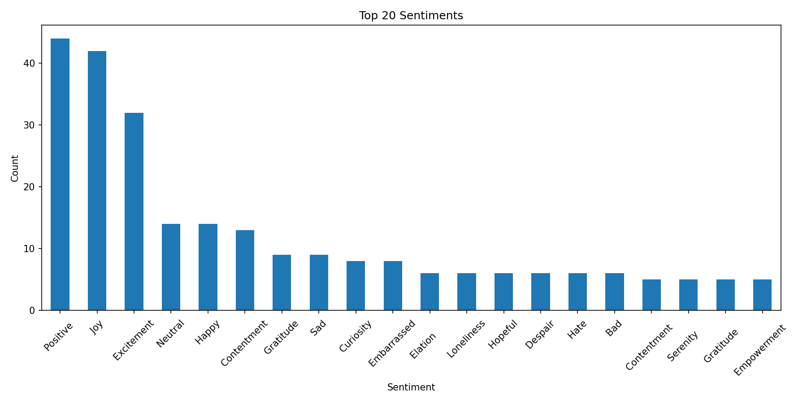
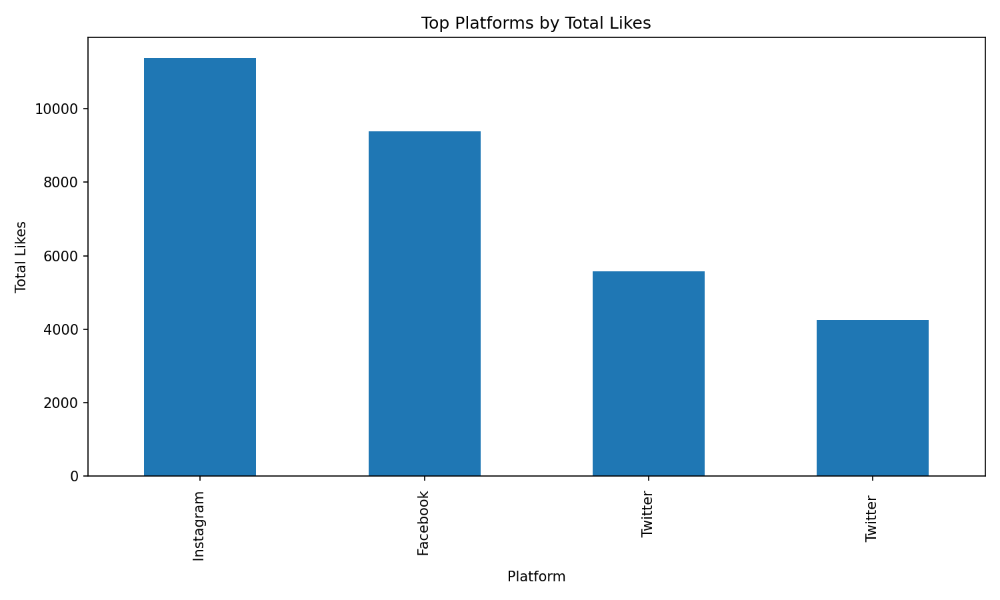

# Social Media Sentiment Analysis

Exploratory data analysis and NLP preprocessing pipeline on a social media
posts dataset — covering data cleaning, EDA, sentiment label encoding, and
text tokenization to prepare data for downstream sentiment classification.

## Overview

This project analyzes ~700 social media posts labeled with fine-grained
sentiment tags (e.g. `Positive`, `Joy`, `Excitement`, `Sad`, `Loneliness`)
across platforms like Twitter, Instagram, and Facebook. The notebook walks
through:

- **Data cleaning** — dropping redundant index columns, removing duplicate
  rows, checking for missing values
- **Exploratory data analysis** — sentiment distribution, platform
  breakdown, engagement (likes/retweets) ranges
- **Preprocessing** — label-encoding the sentiment target and an 80/20
  train/test split
- **Tokenization** — building a 5,000-word vocabulary with Keras'
  `Tokenizer` and padding sequences to a fixed length of 200, producing
  model-ready arrays
- **Visualization** — bar charts of top sentiment categories and top
  platforms by total engagement

## Dataset

`data/sentimentdataset.csv` — 732 rows, 15 columns including `Text`,
`Sentiment`, `Platform`, `Hashtags`, `Retweets`, `Likes`, `Country`, and
timestamp fields (`Year`, `Month`, `Day`, `Hour`).

## Project Structure

```
social-media-sentiment-analysis/
├── data/
│   └── sentimentdataset.csv
├── notebooks/
│   └── social_media_sentiment_analysis.ipynb
├── images/
│   ├── top_20_sentiments.png
│   └── top_platforms_by_likes.png
├── requirements.txt
├── LICENSE
└── README.md
```

## Sample Output

**Top 20 sentiment categories**



**Top platforms by total likes**



## Getting Started

1. Clone the repo:
   ```bash
   git clone https://github.com/siddhusam23/social-media-sentiment-analysis.git
   cd social-media-sentiment-analysis
   ```
2. Install dependencies:
   ```bash
   pip install -r requirements.txt
   ```
3. Launch the notebook:
   ```bash
   jupyter notebook notebooks/social_media_sentiment_analysis.ipynb
   ```

The notebook reads the dataset directly from `../data/sentimentdataset.csv`,
so no path changes or Google Drive mounting are needed.

## Tech Stack

- **pandas / numpy** — data manipulation
- **matplotlib** — visualization
- **scikit-learn** — label encoding, train/test split
- **TensorFlow / Keras** — text tokenization and sequence padding

## Next Steps

- Train a classifier (LSTM/GRU or a transformer-based encoder) on the
  tokenized sequences
- Evaluate model performance against the held-out test set
- Group the 279 fine-grained sentiment labels into broader positive /
  negative / neutral classes for a more tractable classification task

## License

Released under the MIT License — see [LICENSE](LICENSE) for details.
